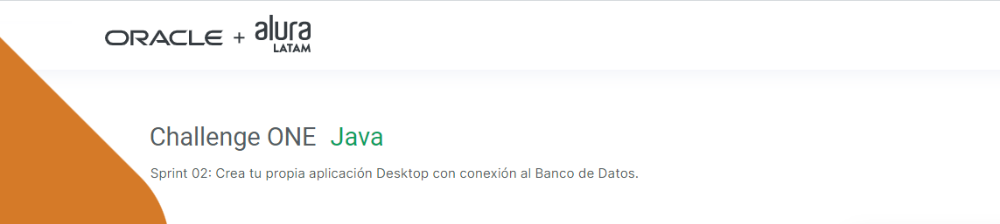
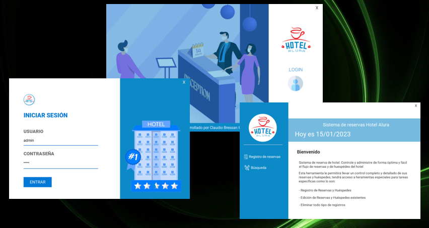
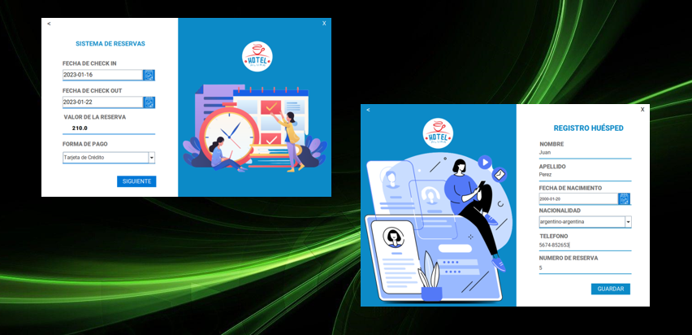
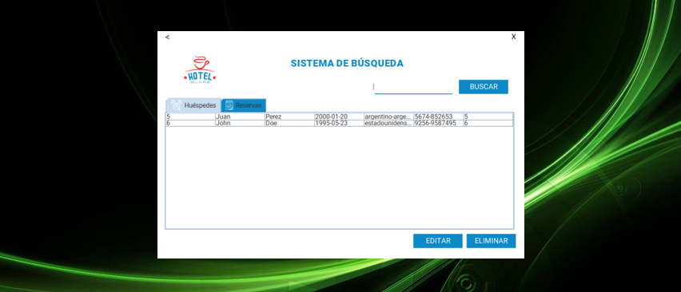

 
   
   
   

---

## Descripción
#### El objetivo de este sexto challenge es poner en práctica los conceptos aprendidos sobre el manejo de Bases de Datos en Java, como parte de la ruta Back-End del programa **ONE**.
---
&nbsp;

## Funcionalidad
  
 El proyecto es una aplicación de escritorio que realiza un CRUD sobre una base de datos relacional.

 El código de las vistas es proporcionado por Alura y el alumno debe centrarse en la lógica referente a la persistencia de los datos. 

 Utilicé los patrones de diseño MVC y DAO para su implementación.

&nbsp;

 La estructura de la aplicación consta de:

 - Ventanas de inicio, login y menú secundario:

&nbsp;

&nbsp;

- Ventanas para el registro de reservas y húspedes: 

&nbsp;
   

- Y una venta de búsqueda, que incluye el resto de las funciones del CRUD:

&nbsp;

#### Marca este proyecto con una estrella ⭐

&nbsp;

---
## Tecnologías utilizadas

---
## Autor
[ Claudio Bressan](https://github.com/Claubress) |
 :---: |
